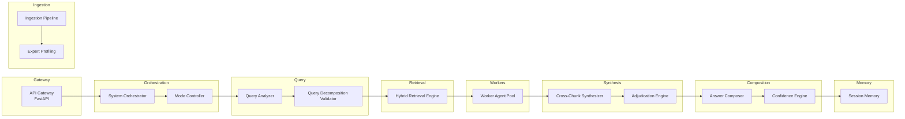

# HelioX RAG 3.0 — Architecture Blueprint

**Retrieval-Guided Multi-Agent Deliberative System**
Enterprise-Grade Production Architecture

---

## Table of Contents

1. [Core Principles](#1-core-principles)
2. [High-Level Technical Architecture](#2-high-level-technical-architecture)
3. [Service Breakdown](#3-service-breakdown-microservice-boundaries)
4. [Data Flow Diagram](#4-data-flow-diagram)
5. [Folder Structure](#5-folder-structure)
6. [API Boundary Definitions](#6-api-boundary-definitions)
7. [Orchestrator Interaction Map](#7-orchestrator-interaction-map)
8. [Failure-Handling Model](#8-failure-handling-model)
9. [Cost-Control Strategy](#9-cost-control-strategy)

---

## 1. Core Principles

| # | Principle | Enforcement |
|---|-----------|-------------|
| 1 | Deterministic preprocessing before probabilistic reasoning | Ingestion pipeline is fully deterministic; no LLM calls until query phase |
| 2 | Metadata-first retrieval, embedding-second | Retrieval cascade: PostgreSQL filters → entity overlap → Qdrant vectors |
| 3 | Selective expert activation | Workers receive single chunks, not full context |
| 4 | Evidence-bound generation | Every factual sentence maps to a citation ID; no uncited claims |
| 5 | Confidence-aware output with gating | Global confidence score gates output path (answer / expand / clarify) |
| 6 | Cost-aware adaptive scaling | Token budgets, dynamic K, early termination, mode switching |
| 7 | Strict loop and retry caps | Hard caps: `MAX_CONFLICT_ROUNDS=2`, bounded retries, timeout walls |

---

## 2. High-Level Technical Architecture

### 2.1 Layer Stack (Orchestration Order)

```
┌─────────────────────────────────────────────────────────────────────┐
│                     LAYER 1 — SYSTEM ORCHESTRATOR                  │
│  Mode selection · Token budget · Timeout · Retry policy · Cost     │
├─────────────────────────────────────────────────────────────────────┤
│                     LAYER 2 — MODE CONTROLLER                      │
│               Light Mode ◄──────────► Heavy Mode                   │
├─────────────────────────────────────────────────────────────────────┤
│                 LAYER 3 — INGESTION PIPELINE (OFFLINE)             │
│  Parse → Chunk → Normalize → Profile → Index                      │
├─────────────────────────────────────────────────────────────────────┤
│             LAYER 4 — MULTI-VECTOR EXPERT PROFILING                │
│  Semantic emb · Entity vec · HyDE · Constraint metadata            │
├─────────────────────────────────────────────────────────────────────┤
│              LAYER 5 — STRUCTURED QUERY ANALYZER                   │
│  Intent · Entities · Constraints · Fact/Reasoning decomposition    │
├─────────────────────────────────────────────────────────────────────┤
│            LAYER 6 — QUERY DECOMPOSITION VALIDATOR                 │
│  Ambiguity detection · Entity grounding · SQO lock                 │
├─────────────────────────────────────────────────────────────────────┤
│              LAYER 7 — HYBRID RETRIEVAL ENGINE                     │
│  Metadata filter → Entity overlap → Vector search → Fallback      │
├─────────────────────────────────────────────────────────────────────┤
│             LAYER 8 — PARALLEL WORKER AGENT LAYER                  │
│  1 worker per chunk · Citation-only · Async parallel               │
├─────────────────────────────────────────────────────────────────────┤
│             LAYER 9 — CROSS-CHUNK SYNTHESIZER                      │
│  Merge · Overlap detection · Contradiction flagging                │
├─────────────────────────────────────────────────────────────────────┤
│             LAYER 10 — ADJUDICATION ENGINE                         │
│  Contradiction resolution · Authority weighting · Max 2 rounds     │
├─────────────────────────────────────────────────────────────────────┤
│          LAYER 11 — EVIDENCE-BOUND ANSWER COMPOSER                 │
│  Citation mapping · Constraint application · Threshold gating      │
├─────────────────────────────────────────────────────────────────────┤
│         LAYER 12 — CONFIDENCE & SELF-VALIDATION ENGINE             │
│  Global score · Calibration · Expand/Clarify triggers              │
├─────────────────────────────────────────────────────────────────────┤
│            LAYER 13 — CONTROLLED SESSION MEMORY                    │
│  Validated summaries · Confirmed constraints · Preferences         │
└─────────────────────────────────────────────────────────────────────┘
```

### 2.2 System Orchestrator — Hard Limits

| Parameter | Default | Notes |
|-----------|---------|-------|
| `MAX_WORKERS_PER_QUERY` | 12 | Matches max final K |
| `MAX_CONFLICT_ROUNDS` | 2 | Unresolved after 2 → highest-weighted consensus |
| `MAX_TOKEN_BUDGET` | 32,000 | Per-query ceiling across all LLM calls |
| `MAX_RETRIEVAL_EXPANSIONS` | 2 | Fallback/expansion limit before user-clarification |
| `QUERY_TIMEOUT_MS` | 30,000 | Hard wall; partial results returned on breach |

### 2.3 Mode Controller — Decision Matrix

```
                        ┌───────────────────┐
                        │  Incoming Query    │
                        └────────┬──────────┘
                                 │
                    ┌────────────▼────────────┐
                    │   Intent Classifier     │
                    │  (pre-LLM heuristics)   │
                    └────────────┬────────────┘
                                 │
              ┌──────────────────┼──────────────────┐
              │                  │                   │
      intent ∈ {fact,           intent ∈ {compare,  ambiguity
       simple lookup}            synthesis,          detected
              │                  compliance}         │
              ▼                  ▼                   ▼
        ┌──────────┐      ┌──────────────┐    ┌───────────┐
        │  LIGHT   │      │    HEAVY     │    │   HEAVY   │
        │  MODE    │      │    MODE      │    │   MODE    │
        └──────────┘      └──────────────┘    └───────────┘

  Light → Heavy Escalation:
    IF light_mode_confidence < 0.70  →  re-enter as Heavy
```

**Light Mode** constraints: single retrieval pass, top-K ∈ [5, 8], no multi-agent adjudication, response within 3 s target.

**Heavy Mode** activates: parallel workers, cross-chunk synthesis, conflict detection + re-verification (max 2 rounds), confidence gating.

### 2.4 Ingestion Pipeline (Deterministic, Offline)

```
  Raw Document
       │
       ▼
  ┌──────────────────┐
  │ File Type Detect  │  (PDF, DOCX, HTML, Markdown, CSV)
  └────────┬─────────┘
           ▼
  ┌──────────────────┐
  │ Structural Parser │  section → subsection → paragraph → sentence
  └────────┬─────────┘
           ├──── Table Extraction (tabular data → structured JSON)
           │
           ▼
  ┌──────────────────┐
  │  Noise Removal    │  headers, footers, watermarks, boilerplate
  └────────┬─────────┘
           ▼
  ┌──────────────────────────┐
  │ Parent–Child Graph Build  │  document tree with section hierarchy
  └────────┬─────────────────┘
           ▼
  ┌──────────────────────────────────────────────┐
  │ Adaptive Chunking                            │
  │   target: 800–1200 tokens                    │
  │   overlap: 15% sliding window                │
  │   boundary: prefer sentence/paragraph breaks │
  └────────┬─────────────────────────────────────┘
           ▼
  ┌──────────────────────────────┐
  │ Ontology Normalization       │  (preserves original text)
  │   - Abbreviation resolution  │
  │   - Synonym expansion        │
  │   - Term standardization     │
  └────────┬─────────────────────┘
           ▼
  Structured Document Graph (JSON)
```

**Output schema** — Structured Document Graph:

```json
{
  "document_id": "uuid",
  "source_file": "path",
  "ingested_at": "ISO-8601",
  "sections": [
    {
      "section_id": "uuid",
      "title": "string",
      "level": 1,
      "parent_id": null,
      "chunks": [
        {
          "chunk_id": "uuid",
          "text": "original text preserved",
          "token_count": 1024,
          "span_index": [0, 1024],
          "normalized_entities": ["entity_a"],
          "abbreviations_resolved": {"API": "Application Programming Interface"},
          "tables": [],
          "parent_section_id": "uuid"
        }
      ]
    }
  ]
}
```

### 2.5 Multi-Vector Expert Profiling

For **each chunk**, the profiling layer generates and stores:

| Vector / Metadata | Storage | Purpose |
|---|---|---|
| Primary semantic embedding | Qdrant | Core similarity search |
| Entity vector (NER-based) | Qdrant (separate collection) | Entity-overlap filtering |
| HyDE embedding | Qdrant (separate collection) | Optional recall expansion |
| Constraint metadata (temporal, geo, regulatory, applicability) | PostgreSQL | Metadata-first filtering |
| Authority score | PostgreSQL | Source weighting during adjudication |
| Timestamp | PostgreSQL | Recency scoring |
| Parent section reference | PostgreSQL | Context reconstruction |

**Embedding Weighting During Retrieval:**

```
retrieval_score =
    α × cosine_sim(query_emb, semantic_emb)      [α = 0.55]
  + β × cosine_sim(query_emb, entity_vec)         [β = 0.30]
  + γ × cosine_sim(hyde_emb, semantic_emb)         [γ = 0.15]    (if HyDE enabled)
```

- `γ` is set to `0.0` unless the orchestrator enables HyDE expansion (low initial recall scenario).

**HyDE Usage Policy:**
- HyDE vectors are generated at indexing time and stored in an isolated collection.
- Activated only when Stage 3 (vector search) recall falls below `MIN_RECALL_THRESHOLD` (default 0.60).
- Query-time HyDE: a hypothetical answer is generated by a lightweight LLM call (budget-capped at 200 tokens) and embedded for a secondary vector search pass.

**Embedding Versioning:**
- Each embedding is tagged with `model_id` + `model_version` in PostgreSQL.
- Re-indexing is triggered on model upgrade via a background job that processes chunks in batches, dual-writes to a shadow collection, and swaps atomically after validation.

**Storage Layout:**

| Store | Contents | Access Pattern |
|---|---|---|
| **Qdrant** | `semantic_embeddings`, `entity_vectors`, `hyde_embeddings` (3 collections) | Vector similarity queries |
| **PostgreSQL** | Chunk metadata, constraint fields, authority scores, timestamps, parent refs, embedding version registry | Structured filtering, joins |
| **Redis** | Hot cache of recent query → chunk-id-set mappings, top-K results per query hash | Sub-10 ms repeated-query fast path |

### 2.6 Structured Query Pipeline

#### Query Analyzer

```
  User Query
       │
       ▼
  ┌──────────────────────────┐
  │  Intent Classification   │  → fact / comparison / synthesis / compliance
  └────────┬─────────────────┘
           ▼
  ┌──────────────────────────┐
  │  Entity Extraction       │  → named entities, terms, identifiers
  └────────┬─────────────────┘
           ▼
  ┌──────────────────────────┐
  │  Constraint Extraction   │  → temporal, geographic, regulatory, scope
  └────────┬─────────────────┘
           ▼
  ┌──────────────────────────┐
  │  Decomposition           │  → fact components + reasoning components
  └────────┬─────────────────┘
           ▼
  Structured Query Object (SQO) — Draft
```

#### Query Decomposition Validator

| Check | Action on Failure |
|---|---|
| Ambiguity detection | Flag for user clarification OR infer most-likely interpretation with reduced confidence |
| Missing constraints | Inject defaults if safe; otherwise flag |
| Entity grounding | Verify all entities exist in indexed corpus; ungrounded → warning |
| Decomposition confidence | If score < 0.65 → re-decompose with refined prompt (max 1 retry) |
| SQO lock | Freeze SQO — no further mutation downstream |

**SQO Schema:**

```json
{
  "query_id": "uuid",
  "original_query": "string",
  "intent": "fact | comparison | synthesis | compliance",
  "entities": ["entity_a", "entity_b"],
  "constraints": {
    "temporal": {"after": "2024-01-01", "before": null},
    "geographic": ["EU"],
    "regulatory": ["GDPR"],
    "scope": "section-level"
  },
  "fact_components": ["sub-question-1", "sub-question-2"],
  "reasoning_components": ["compare X vs Y on dimension Z"],
  "decomposition_confidence": 0.87,
  "locked": true
}
```

### 2.7 Hybrid Retrieval Engine

#### Retrieval Cascade

```
  SQO (locked)
       │
       ▼
  ┌─────────────────────────────────────────────────┐
  │ STAGE 1 — Metadata Filtering (PostgreSQL)       │
  │   Filter by: temporal, geographic, regulatory,  │
  │   applicability, authority score threshold       │
  │   Output: candidate chunk IDs                   │
  └────────┬────────────────────────────────────────┘
           ▼
  ┌─────────────────────────────────────────────────┐
  │ STAGE 2 — Entity Overlap Filtering              │
  │   Intersect SQO entities with chunk entity      │
  │   vectors; retain chunks with overlap ≥ 1       │
  └────────┬────────────────────────────────────────┘
           ▼
  ┌─────────────────────────────────────────────────┐
  │ STAGE 3 — Vector Similarity Search (Qdrant)     │
  │   Search within Stage 2 candidate set           │
  │   Initial K = 25                                │
  └────────┬────────────────────────────────────────┘
           ▼
  ┌─────────────────────────────────────────────────┐
  │ STAGE 4 — Fallback Broad Retrieval              │
  │   Activated ONLY if recall < MIN_RECALL (0.60)  │
  │   Broadens filters, optionally enables HyDE     │
  │   Bounded by MAX_RETRIEVAL_EXPANSIONS (2)       │
  └────────┬────────────────────────────────────────┘
           ▼
  Re-rank and Dynamic K Reduction → Final K ∈ [5, 12]
```

#### Dynamic K Strategy

```
  Initial candidates: K₀ = 25
       │
       ▼
  Apply metadata + entity filters → K₁ ≤ 25
       │
       ▼
  Rank by relevance_score (see formula below)
       │
       ▼
  ┌──────────────────────────────────────────────┐
  │  FOR i = 1 to K₁:                           │
  │    coverage_gain(i) = coverage(1..i) -       │
  │                       coverage(1..i-1)       │
  │    IF coverage_gain(i) < ε (0.02)            │
  │       → STOP, set final K = i - 1            │
  │  END                                         │
  │                                              │
  │  Clamp: final K ∈ [5, 12]                    │
  └──────────────────────────────────────────────┘
```

#### Relevance-Aware Scoring

```
weighted_score =
    (w1 × recency)                 [w1 = 0.10]
  + (w2 × source_rank)            [w2 = 0.15]
  + (w3 × citation_density)       [w3 = 0.10]
  + (w4 × worker_confidence)      [w4 = 0.10]   (0 on first pass)
  + (w5 × cosine_similarity)      [w5 = 0.35]
  + (w6 × query_coverage_score)   [w6 = 0.20]
```

All weights sum to 1.0. Weights are configurable per-deployment.

### 2.8 Parallel Worker Agents

```
  Final Chunk Set (K chunks)
       │
       ├─── chunk_1 ──► Worker_1  ─┐
       ├─── chunk_2 ──► Worker_2  ─┤
       ├─── chunk_3 ──► Worker_3  ─┤   (async parallel)
       │       ...                  │
       └─── chunk_K ──► Worker_K  ─┘
                                    │
                                    ▼
                          Collected Worker Outputs
```

**Worker Contract:**

Each worker receives:
- The locked SQO
- Exactly one chunk (with chunk metadata, span indices)
- System prompt enforcing: "You may only cite the provided chunk."

**Worker Output Schema:**

```json
{
  "worker_id": "uuid",
  "chunk_id": "uuid",
  "claim": "Factual statement derived from chunk",
  "supporting_spans": [
    {"start": 142, "end": 387, "text": "exact quoted span"}
  ],
  "reasoning_trace": "Step-by-step reasoning path",
  "confidence_local": 0.88,
  "coverage_score": 0.45,
  "status": "SUFFICIENT | INSUFFICIENT"
}
```

**Rules:**
- No external knowledge — only the provided chunk.
- Every claim must cite exact span indices within the chunk.
- If evidence is insufficient → return `status: "INSUFFICIENT"` with no claim.
- **Early termination**: if the orchestrator determines global confidence ≥ threshold after N < K workers complete, remaining workers are cancelled.

### 2.9 Cross-Chunk Synthesizer

```
  Collected Worker Outputs
       │
       ▼
  ┌─────────────────────────────────┐
  │ Claim Deduplication             │  semantic similarity > 0.92 → merge
  └────────┬────────────────────────┘
           ▼
  ┌─────────────────────────────────┐
  │ Complementary Claim Merging     │  combine non-overlapping claims
  └────────┬────────────────────────┘
           ▼
  ┌─────────────────────────────────┐
  │ Contradiction Candidate Detect  │  flag semantically opposing claims
  └────────┬────────────────────────┘
           ▼
  ┌─────────────────────────────────┐
  │ Evidence Graph Construction     │  claims → supporting spans → chunks
  └────────┬────────────────────────┘
           ▼
  ┌─────────────────────────────────┐
  │ Global Coverage Score           │  fraction of SQO fact-components
  │                                 │  covered by merged evidence set
  └────────┬────────────────────────┘
           ▼
  Synthesized Evidence Set + Conflict Candidates
```

### 2.10 Adjudication Engine

```
  Conflict Candidates
       │
       ▼
  ┌──────────────────────────────────────┐
  │ Semantic Contradiction Detection     │
  │   Pairwise entailment scoring        │
  │   Threshold: ≤ 0.30 → contradiction  │
  └────────┬─────────────────────────────┘
           ▼
  ┌──────────────────────────────────────┐
  │ Authority Weighting                  │
  │   Source rank × recency × agreement  │
  └────────┬─────────────────────────────┘
           ▼
  ┌──────────────────────────────────────┐
  │ Cross-Worker Agreement Scoring       │
  │   # workers supporting claim / total │
  └────────┬─────────────────────────────┘
           ▼
  ┌──────────────────────────────────────────────────────┐
  │ Re-Verification Loop                                 │
  │   Round 1: re-read conflicting chunks, re-score      │
  │   Round 2: if still unresolved, re-read with context │
  │   MAX_CONFLICT_ROUNDS = 2                            │
  └────────┬─────────────────────────────────────────────┘
           ▼
  ┌──────────────────────────────────────┐
  │ Resolution Policy                    │
  │   resolved   → accept winning claim  │
  │   unresolved → highest weighted      │
  │                consensus; reduce     │
  │                global confidence     │
  └──────────────────────────────────────┘
```

### 2.11 Evidence-Bound Answer Composer

**Strict Rules:**
1. Every factual sentence in the answer **must** map to at least one `citation_id`.
2. All constraints from the SQO **must** be applied and reflected in the answer.
3. If `global_coverage_score < COVERAGE_THRESHOLD` (default 0.60) → return "Insufficient evidence to fully answer this query." with partial results.

**Output Schema:**

```json
{
  "answer": {
    "direct_answer": "string (every sentence has inline citation markers)",
    "supporting_evidence": [
      {
        "citation_id": "C1",
        "chunk_id": "uuid",
        "span": {"start": 142, "end": 387},
        "text": "exact quoted span"
      }
    ],
    "constraints_applied": {
      "temporal": "After 2024-01-01",
      "geographic": "EU",
      "regulatory": "GDPR"
    },
    "confidence_score": 0.85,
    "coverage_score": 0.92,
    "conflict_notes": ["Claim X had unresolved conflict; consensus used."]
  }
}
```

### 2.12 Confidence & Self-Validation Engine

**Global Confidence Formula:**

```
global_confidence = weighted_mean(
    retrieval_coverage      × 0.20,
    citation_density        × 0.20,
    worker_agreement        × 0.20,
    conflict_severity       × 0.15,   (inverted: lower severity → higher score)
    authority_score          × 0.15,
    avg_cosine_similarity   × 0.10
)
```

**Decision Thresholds:**

| Confidence Range | Action |
|---|---|
| ≥ 0.80 | Deliver answer |
| 0.60 – 0.79 | Deliver answer with confidence warning |
| 0.40 – 0.59 | Trigger expanded retrieval (if expansions remaining) |
| < 0.40 | Request user clarification |

**Calibration Strategy:**
- Maintain a rolling evaluation set of 200 human-judged question-answer pairs.
- Weekly calibration job: compute expected calibration error (ECE) across confidence bins.
- Adjust weight vector if ECE > 0.05.

**Logging Metrics:**
- Per-query: confidence, coverage, latency, token usage, mode (light/heavy), conflict count.
- Aggregated: P50/P95 latency, avg confidence, % escalations, cost per query.

### 2.13 Controlled Session Memory

| Stored ✓ | NOT Stored ✗ |
|---|---|
| Validated structured summary of previous answers | Raw worker reasoning traces |
| Confirmed user constraints (carried forward) | Unverified claims |
| User preference context (e.g., preferred format) | LLM speculation or drafts |
| Session query history (SQO sequence) | Intermediate retrieval candidates |

**Memory Lifecycle:**
- Session memory is scoped to a conversation session (default TTL: 30 minutes idle).
- On session close, validated summaries may optionally be persisted to a user-profile store (configurable).
- Redis is the primary session store; PostgreSQL is the durable fallback.

---

## 3. Service Breakdown (Microservice Boundaries)



### Service Definitions

| Service | Deployment | Protocol | Scaling |
|---------|-----------|----------|---------|
| **API Gateway** | Single entrypoint (FastAPI) | REST / WebSocket | Horizontal behind load balancer |
| **System Orchestrator** | Stateful per-request coordinator | Internal gRPC | 1 instance per active query; bounded by `MAX_WORKERS_PER_QUERY` |
| **Mode Controller** | Co-located with Orchestrator | In-process call | Same as Orchestrator |
| **Query Analyzer** | Stateless service | gRPC | Horizontal auto-scale |
| **Query Decomposition Validator** | Stateless service | gRPC | Horizontal auto-scale |
| **Hybrid Retrieval Engine** | Stateless service + DB clients | gRPC | Horizontal; Qdrant/PostgreSQL scale separately |
| **Worker Agent Pool** | Async worker pool | Internal task queue (Kafka or in-memory) | Scale workers 1:1 with `MAX_WORKERS_PER_QUERY`; max pool size configurable |
| **Cross-Chunk Synthesizer** | Stateless service | gRPC | Horizontal auto-scale |
| **Adjudication Engine** | Stateless service | gRPC | Horizontal auto-scale |
| **Answer Composer** | Stateless service | gRPC | Horizontal auto-scale |
| **Confidence Engine** | Co-located with Answer Composer | In-process call | Same as Answer Composer |
| **Ingestion Pipeline** | Offline batch service | Kafka consumer / CLI trigger | Vertical (CPU-bound parsing); parallel per-document |
| **Expert Profiling** | Offline batch service | Kafka consumer | GPU-accelerated for embedding generation |
| **Session Memory** | Stateful (Redis-backed) | gRPC | Redis cluster; read replicas |

---

## 4. Data Flow Diagram

### 4.1 Query-Time Flow (Heavy Mode)

```
USER
 │
 ▼
┌──────────────┐     ┌──────────────────┐     ┌─────────────────────┐
│  API Gateway │────►│ System           │────►│ Mode Controller     │
│  (FastAPI)   │     │ Orchestrator     │     │ → selects HEAVY     │
└──────────────┘     └──────────────────┘     └─────────┬───────────┘
                                                        │
                     ┌──────────────────┐               │
                     │ Session Memory   │◄──────────────┤ (load context)
                     │ (Redis)          │               │
                     └──────────────────┘               │
                                                        ▼
                                              ┌─────────────────────┐
                                              │ Query Analyzer      │
                                              │ → intent, entities, │
                                              │   constraints       │
                                              └─────────┬───────────┘
                                                        ▼
                                              ┌─────────────────────┐
                                              │ Decomposition       │
                                              │ Validator → SQO     │
                                              └─────────┬───────────┘
                                                        ▼
                          ┌─────────────────────────────────────────────────┐
                          │ Hybrid Retrieval Engine                        │
                          │  Stage 1: PostgreSQL metadata filter            │
                          │  Stage 2: Entity overlap                        │
                          │  Stage 3: Qdrant vector search                  │
                          │  Stage 4: Fallback (if needed)                  │
                          │  → Dynamic K → Final chunks [5..12]             │
                          └───────────────────────┬─────────────────────────┘
                                                  │
                          ┌───────────────────────┼───────────────────────┐
                          ▼                       ▼                       ▼
                    ┌───────────┐          ┌───────────┐          ┌───────────┐
                    │ Worker 1  │          │ Worker 2  │   ...    │ Worker K  │
                    └─────┬─────┘          └─────┬─────┘          └─────┬─────┘
                          │                      │                      │
                          └──────────┬───────────┘──────────────────────┘
                                     ▼
                          ┌──────────────────────┐
                          │ Cross-Chunk           │
                          │ Synthesizer           │
                          │ → merged evidence,    │
                          │   conflict candidates │
                          └──────────┬────────────┘
                                     ▼
                          ┌──────────────────────┐
                          │ Adjudication Engine   │
                          │ → resolve conflicts   │
                          │   (max 2 rounds)      │
                          └──────────┬────────────┘
                                     ▼
                          ┌──────────────────────┐
                          │ Answer Composer       │
                          │ → citation-bound      │
                          │   answer              │
                          └──────────┬────────────┘
                                     ▼
                          ┌──────────────────────┐
                          │ Confidence Engine     │
                          │ → score, gate,        │
                          │   decide action       │
                          └──────────┬────────────┘
                                     ▼
                          ┌──────────────────────┐
                          │ Session Memory        │
                          │ → store validated     │
                          │   summary             │
                          └──────────┬────────────┘
                                     ▼
                                   USER
```

### 4.2 Ingestion-Time Flow (Offline)

```
  Raw Documents (PDF, DOCX, HTML, CSV, MD)
       │
       ▼
  ┌──────────────────────┐
  │ Ingestion Pipeline   │
  │  (Kafka consumer or  │
  │   CLI batch trigger) │
  └────────┬─────────────┘
           │
           ▼
  Structured Document Graph (JSON)
           │
           ▼
  ┌──────────────────────┐     ┌──────────────┐
  │ Expert Profiling     │────►│ Qdrant       │  (3 collections)
  │  (embedding gen +    │     └──────────────┘
  │   metadata extract)  │
  │                      │────►┌──────────────┐
  │                      │     │ PostgreSQL   │  (metadata tables)
  └──────────────────────┘     └──────────────┘
```

---

## 5. Folder Structure

```
heliox-rag/
├── gateway/
│   ├── main.py                   # FastAPI application entrypoint
│   ├── routes/
│   │   ├── query.py              # POST /query, GET /query/{id}/status
│   │   ├── ingest.py             # POST /ingest, GET /ingest/{job_id}
│   │   ├── session.py            # Session management endpoints
│   │   └── health.py             # Health / readiness probes
│   ├── middleware/
│   │   ├── auth.py               # Authentication middleware
│   │   ├── rate_limit.py         # Rate limiting
│   │   └── cost_guard.py         # Per-request cost ceiling check
│   └── schemas/
│       ├── query.py              # Request/response models
│       ├── ingest.py
│       └── common.py
│
├── orchestrator/
│   ├── orchestrator.py           # System Orchestrator core
│   ├── mode_controller.py        # Light / Heavy mode decision
│   ├── token_budget.py           # Token budget tracker
│   ├── timeout_manager.py        # Per-query timeout enforcement
│   ├── retry_policy.py           # Retry caps and backoff
│   └── observability.py          # Metrics emission, trace hooks
│
├── query_pipeline/
│   ├── analyzer.py               # Intent, entity, constraint extraction
│   ├── decomposer.py             # Fact + reasoning decomposition
│   ├── validator.py              # Ambiguity, grounding, SQO lock
│   └── schemas.py                # SQO schema definitions
│
├── retrieval/
│   ├── engine.py                 # Hybrid retrieval orchestration
│   ├── metadata_filter.py        # Stage 1: PostgreSQL queries
│   ├── entity_filter.py          # Stage 2: Entity overlap
│   ├── vector_search.py          # Stage 3: Qdrant search
│   ├── fallback.py               # Stage 4: Broad retrieval
│   ├── dynamic_k.py              # Dynamic K with coverage gain
│   └── scoring.py                # Relevance-aware scoring formula
│
├── workers/
│   ├── pool.py                   # Async worker pool manager
│   ├── worker.py                 # Single worker logic
│   ├── prompts.py                # Worker system prompts
│   └── schemas.py                # Worker output schema
│
├── synthesis/
│   ├── synthesizer.py            # Cross-chunk merging
│   ├── dedup.py                  # Claim deduplication
│   ├── conflict_detector.py      # Contradiction candidate detection
│   └── evidence_graph.py         # Evidence graph construction
│
├── adjudication/
│   ├── engine.py                 # Adjudication loop
│   ├── contradiction.py          # Semantic contradiction scoring
│   ├── authority.py              # Authority weighting
│   └── consensus.py              # Cross-worker agreement
│
├── composer/
│   ├── answer.py                 # Evidence-bound answer assembly
│   ├── citation_mapper.py        # Sentence → citation mapping
│   └── templates.py              # Output format templates
│
├── confidence/
│   ├── engine.py                 # Global confidence computation
│   ├── calibration.py            # ECE calibration job
│   ├── thresholds.py             # Decision threshold config
│   └── metrics.py                # Per-query metric logging
│
├── memory/
│   ├── session_store.py          # Redis-backed session memory
│   ├── lifecycle.py              # TTL management, cleanup
│   └── schemas.py                # Memory record schemas
│
├── ingestion/
│   ├── pipeline.py               # Ingestion pipeline orchestrator
│   ├── parsers/
│   │   ├── pdf.py
│   │   ├── docx.py
│   │   ├── html.py
│   │   ├── csv_parser.py
│   │   └── markdown.py
│   ├── chunker.py                # Adaptive chunking (800–1200 tokens)
│   ├── normalizer.py             # Ontology normalization
│   ├── graph_builder.py          # Parent–child graph
│   └── noise_removal.py          # Boilerplate removal
│
├── profiling/
│   ├── embedder.py               # Multi-vector embedding generation
│   ├── entity_extractor.py       # NER-based entity vectors
│   ├── hyde_generator.py         # HyDE embedding generation
│   ├── metadata_extractor.py     # Constraint metadata extraction
│   └── versioning.py             # Embedding version management
│
├── infrastructure/
│   ├── db/
│   │   ├── postgres.py           # PostgreSQL connection pool
│   │   ├── qdrant.py             # Qdrant client wrapper
│   │   └── redis.py              # Redis client wrapper
│   ├── kafka/
│   │   ├── producer.py
│   │   └── consumer.py
│   ├── config.py                 # Centralized configuration
│   └── logging.py                # Structured logging setup
│
├── tests/
│   ├── unit/
│   ├── integration/
│   └── calibration/              # Confidence calibration test suite
│
├── deploy/
│   ├── docker/
│   │   ├── Dockerfile.gateway
│   │   ├── Dockerfile.worker
│   │   ├── Dockerfile.ingestion
│   │   └── docker-compose.yml
│   ├── k8s/
│   │   ├── gateway-deployment.yaml
│   │   ├── worker-deployment.yaml
│   │   ├── ingestion-job.yaml
│   │   └── configmap.yaml
│   └── terraform/
│       └── main.tf
│
├── docs/
│   ├── architecture_blueprint.md  # ← This document
│   ├── api_reference.md
│   └── runbook.md
│
├── pyproject.toml
├── README.md
└── .env.example
```

---

## 6. API Boundary Definitions

### 6.1 External APIs (Gateway)

#### `POST /v1/query`

Submit a query for processing.

**Request:**

```json
{
  "query": "string",
  "session_id": "uuid | null",
  "mode_override": "light | heavy | auto",
  "max_token_budget": 32000,
  "timeout_ms": 30000,
  "preferences": {
    "format": "detailed | concise",
    "include_evidence": true
  }
}
```

**Response (200):**

```json
{
  "query_id": "uuid",
  "answer": "string (with inline citation markers [C1], [C2]...)",
  "evidence": [
    {
      "citation_id": "C1",
      "chunk_id": "uuid",
      "document_id": "uuid",
      "span_text": "exact quoted span",
      "source_title": "string"
    }
  ],
  "constraints_applied": {},
  "confidence_score": 0.85,
  "coverage_score": 0.92,
  "mode_used": "heavy",
  "token_usage": {
    "total": 12400,
    "retrieval": 800,
    "workers": 9600,
    "synthesis": 2000
  },
  "latency_ms": 4200,
  "warnings": []
}
```

**Response (202 — async if timeout exceeded):**

```json
{
  "query_id": "uuid",
  "status": "processing",
  "poll_url": "/v1/query/{query_id}/status"
}
```

---

#### `GET /v1/query/{query_id}/status`

Poll for async query results.

**Response:**

```json
{
  "query_id": "uuid",
  "status": "processing | completed | failed | partial",
  "result": "...same as POST /v1/query response...",
  "progress": {
    "stage": "retrieval | workers | synthesis | adjudication | composition",
    "workers_completed": 8,
    "workers_total": 12
  }
}
```

---

#### `POST /v1/ingest`

Submit documents for ingestion.

**Request:** `multipart/form-data` with files + metadata JSON.

**Response (202):**

```json
{
  "job_id": "uuid",
  "status": "queued",
  "documents_accepted": 5,
  "poll_url": "/v1/ingest/{job_id}"
}
```

---

#### `GET /v1/ingest/{job_id}`

Poll ingestion job status.

---

#### `DELETE /v1/session/{session_id}`

Clear session memory.

---

#### `GET /health`

Readiness probe. Returns `200` with dependency status (PostgreSQL, Qdrant, Redis).

---

### 6.2 Internal Service APIs (gRPC)

| Service | RPC | Input | Output |
|---------|-----|-------|--------|
| **QueryAnalyzer** | `AnalyzeQuery` | `{query, session_context}` | `{SQO_draft}` |
| **QueryValidator** | `ValidateSQO` | `{SQO_draft}` | `{SQO_locked, warnings}` |
| **RetrievalEngine** | `Retrieve` | `{SQO_locked, k_initial}` | `{chunks[], scores[], final_k}` |
| **WorkerPool** | `DispatchWorkers` | `{SQO_locked, chunks[]}` | `stream {worker_output}` |
| **Synthesizer** | `Synthesize` | `{worker_outputs[]}` | `{merged_evidence, conflicts[]}` |
| **Adjudicator** | `Adjudicate` | `{conflicts[], evidence}` | `{resolved_evidence, unresolved[]}` |
| **Composer** | `Compose` | `{evidence, SQO, constraints}` | `{answer, citations[]}` |
| **ConfidenceEngine** | `Score` | `{all_metrics}` | `{confidence, action}` |
| **SessionMemory** | `Load` / `Save` | `{session_id}` | `{context}` / `{ack}` |

---

## 7. Orchestrator Interaction Map

### 7.1 Orchestrator State Machine

```
                        ┌────────────────────┐
                        │      IDLE          │
                        └────────┬───────────┘
                                 │ receive query
                                 ▼
                        ┌────────────────────┐
          ┌─────────────│   INIT             │
          │             │ • load session      │
          │             │ • start budget      │
          │             │ • start timeout     │
          │             └────────┬───────────┘
          │                      │
          │                      ▼
          │             ┌────────────────────┐
          │             │   MODE_SELECT      │
          │             │ • classify intent   │
          │             │ • decide light/heavy│
          │             └────────┬───────────┘
          │                      │
          │        ┌─────────────┼─────────────┐
          │        ▼                           ▼
          │   ┌──────────┐             ┌──────────────┐
          │   │  LIGHT   │             │    HEAVY     │
          │   │  PATH    │             │    PATH      │
          │   └────┬─────┘             └──────┬───────┘
          │        │                          │
          │        │             ┌────────────┼────────────┐
          │        │             ▼            ▼            ▼
          │        │        ANALYZE     RETRIEVE      DISPATCH
          │        │             │            │        WORKERS
          │        │             │            │            │
          │        │             └────────────┼────────────┘
          │        │                          │
          │        │                          ▼
          │        │                    SYNTHESIZE
          │        │                          │
          │        │                          ▼
          │        │                    ADJUDICATE
          │        │                    (max 2 rounds)
          │        │                          │
          │        └──────────────┬────────────┘
          │                      │
          │                      ▼
          │             ┌────────────────────┐
          │             │   COMPOSE          │
          │             └────────┬───────────┘
          │                      │
          │                      ▼
          │             ┌────────────────────┐
          │             │   VALIDATE         │
          │             │ • confidence score  │
          │             │ • coverage check    │
          │             └────────┬───────────┘
          │                      │
          │        ┌─────────────┼─────────────┐
          │        ▼             ▼             ▼
          │   confidence     confidence     confidence
          │   ≥ 0.80         0.40–0.79      < 0.40
          │     │               │              │
          │     ▼               ▼              ▼
          │   DELIVER       EXPAND or       REQUEST
          │                 WARN            CLARIFICATION
          │     │               │
          │     │     ┌─────────┘
          │     │     │  (back to RETRIEVE if expansions remain)
          │     │     │
          │     └─────┼──────────────────┐
          │           │                  │
          │           ▼                  ▼
          │   ┌────────────────────┐
          │   │   SAVE_MEMORY      │
          │   └────────┬───────────┘
          │            │
          │            ▼
          │   ┌────────────────────┐
          └──►│   IDLE             │
              └────────────────────┘

  TIMEOUT or BUDGET_EXCEEDED at ANY state
       → emit partial result → SAVE_MEMORY → IDLE
```

### 7.2 Orchestrator Decision Points

| Decision Point | Condition | Action |
|---|---|---|
| Mode selection | Intent ∈ {comparison, synthesis, compliance} OR ambiguity detected | → Heavy Mode |
| Light→Heavy escalation | Light-mode confidence < 0.70 | Re-enter pipeline as Heavy |
| Worker early termination | Global confidence ≥ 0.90 after N workers | Cancel remaining workers |
| Retrieval expansion | Recall < 0.60 AND expansions < `MAX_RETRIEVAL_EXPANSIONS` | Broaden filters, optionally enable HyDE |
| Conflict loop exit | Round count ≥ `MAX_CONFLICT_ROUNDS` (2) | Accept highest-weighted consensus |
| Budget exceeded | Token usage ≥ `MAX_TOKEN_BUDGET` | Halt, compose partial answer |
| Timeout exceeded | Wall time ≥ `QUERY_TIMEOUT_MS` | Halt, compose partial answer |
| Insufficient coverage | Coverage < 0.60 after all expansions | Return "Insufficient evidence" |

---

## 8. Failure-Handling Model

### 8.1 Failure Taxonomy

```
┌──────────────────────────────────────────────────────────────┐
│                      FAILURE CATEGORIES                      │
├──────────────┬──────────────┬──────────────┬────────────────┤
│ Transient    │ Degraded     │ Logic        │ Catastrophic   │
│ (retryable)  │ (partial)    │ (data issue) │ (abort)        │
├──────────────┼──────────────┼──────────────┼────────────────┤
│ DB timeout   │ Worker fail  │ SQO invalid  │ OOM            │
│ Network err  │ Low recall   │ No grounding │ Corrupted idx  │
│ LLM rate     │ Partial      │ Circular     │ Auth failure   │
│ limit        │ synthesis    │ conflict     │                │
└──────────────┴──────────────┴──────────────┴────────────────┘
```

### 8.2 Retry Policy

| Category | Max Retries | Backoff | Fallback |
|---|---|---|---|
| DB connection | 3 | Exponential (100ms base, 2x, jitter) | Circuit breaker → fail request |
| LLM API | 2 | Exponential (500ms base) | Return partial answer |
| Worker failure | 1 | Immediate (re-dispatch to different worker) | Exclude chunk from synthesis |
| Qdrant search | 2 | Exponential (200ms base) | Fall back to metadata-only retrieval |
| Redis cache miss | 0 | N/A | Compute fresh (cache is optional) |

### 8.3 Circuit Breaker Configuration

| Dependency | Failure Threshold | Recovery Window |
|---|---|---|
| PostgreSQL | 5 failures in 30 s | 60 s half-open test |
| Qdrant | 5 failures in 30 s | 60 s half-open test |
| LLM API | 3 failures in 15 s | 30 s half-open test |
| Redis | 10 failures in 60 s | 30 s half-open test |

### 8.4 Graceful Degradation Ladder

```
Level 0 (Nominal)    → Full pipeline, Heavy mode available
Level 1 (Degraded)   → Force Light mode, reduce top-K to 5
Level 2 (Minimal)    → Metadata-only retrieval, skip workers, direct LLM answer with caveats
Level 3 (Offline)    → Return cached answers if available, otherwise 503
```

### 8.5 Timeout Cascade

```
  Query Timeout: 30,000 ms
       │
       ├─── Query Analysis:     2,000 ms hard wall
       ├─── Retrieval:          5,000 ms hard wall
       ├─── Worker Pool:       15,000 ms (soft) → partial results at timeout
       ├─── Synthesis:          3,000 ms hard wall
       ├─── Adjudication:       3,000 ms hard wall (per round)
       └─── Composition:        2,000 ms hard wall
```

---

## 9. Cost-Control Strategy

### 9.1 Token Budget Allocation

Per-query budget: `MAX_TOKEN_BUDGET = 32,000 tokens` (default)

| Phase | Budget Share | Max Tokens | Notes |
|---|---|---|---|
| Query Analysis | 5% | 1,600 | Intent + decomposition |
| Retrieval (HyDE) | 3% | 960 | Only if HyDE expansion triggered |
| Workers (total) | 60% | 19,200 | Divided across K workers |
| Synthesis | 12% | 3,840 | Cross-chunk merge |
| Adjudication | 10% | 3,200 | Max 2 rounds |
| Composition | 10% | 3,200 | Final answer generation |

**Enforcement:** The orchestrator tracks cumulative token usage. If a phase exceeds its allocation, the orchestrator truncates output and shifts remaining budget to composition (ensuring an answer is always generated).

### 9.2 Cost Levers

| Lever | Mechanism | Savings |
|---|---|---|
| **Mode Controller** | Light mode skips workers, synthesis, adjudication | ~70% token reduction |
| **Dynamic K** | Stop retrieving when marginal gain < ε | Fewer workers dispatched |
| **Early termination** | Cancel workers when confidence ≥ 0.90 | Proportional to cancelled workers |
| **HyDE gating** | Only generate HyDE when recall < threshold | Avoids unnecessary LLM calls |
| **Redis cache** | Cache query → result for repeated queries | 100% savings on cache hit |
| **Degradation ladder** | Force Light mode under load | Prevents runaway costs |

### 9.3 Per-Query Cost Tracking

```json
{
  "query_id": "uuid",
  "cost_breakdown": {
    "llm_tokens_input": 8200,
    "llm_tokens_output": 4100,
    "llm_cost_usd": 0.037,
    "embedding_calls": 2,
    "embedding_cost_usd": 0.0004,
    "db_queries": 14,
    "total_estimated_cost_usd": 0.0374
  },
  "budget_utilization": 0.38,
  "mode": "heavy"
}
```

### 9.4 Organizational Cost Guardrails

| Guardrail | Limit | Action on Breach |
|---|---|---|
| Per-query token ceiling | 32,000 | Hard stop → compose partial answer |
| Per-user hourly budget | Configurable | Rate limit → 429 response |
| Per-org daily budget | Configurable | Disable Heavy mode → Light only |
| Monthly spend alert | Configurable | Alert ops team; optionally degrade to Level 1 |

### 9.5 Observability & Monitoring

| Metric | Granularity | Dashboard |
|---|---|---|
| Token usage per query | Per-request | Real-time |
| Cost per query (USD) | Per-request | Real-time |
| P50 / P95 latency | Per-request | Real-time |
| Mode distribution (Light / Heavy) | Hourly | Trend |
| Cache hit rate | Hourly | Trend |
| Confidence distribution | Daily | Calibration |
| Escalation rate (Light → Heavy) | Daily | Trend |
| Conflict rate | Daily | Quality |
| Worker failure rate | Hourly | Alert |
| Circuit breaker trips | Per-event | Alert |

---

## Appendix: Tech Stack Summary

| Component | Technology | Justification |
|---|---|---|
| API Gateway | FastAPI | Async-native, OpenAPI spec generation, high throughput |
| Internal RPC | gRPC (protobuf) | Low-latency, typed contracts, streaming support |
| Metadata DB | PostgreSQL | ACID, rich query capabilities, JSONB for flexible metadata |
| Vector DB | Qdrant | Purpose-built for vector search, filtering, payload storage |
| Cache | Redis | Sub-ms latency, TTL support, pub/sub for invalidation |
| Async Queue | Kafka (optional) | Durable ingestion queue, replay capability, backpressure |
| Workers | Python asyncio | Consistent stack, native async support |
| Embedding Models | Configurable (e.g., `text-embedding-3-large`) | Versioned, swappable via profiling layer |
| LLM | Configurable (e.g., GPT-4o, Claude) | Budget-aware model selection per phase |
| Container Runtime | Docker + Kubernetes | Standard production orchestration |
| IaC | Terraform | Reproducible infrastructure provisioning |
| Observability | OpenTelemetry + Prometheus + Grafana | Traces, metrics, dashboards, alerting |

---

*HelioX RAG 3.0 — Architecture Blueprint v1.0*
*Generated: 2026-03-03*
